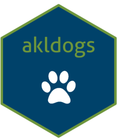

<!-- README.md is generated from README.Rmd. Please edit that file -->

# akldogs <a href="https://tesaunders.github.io/akldogs/"></a>

<!-- badges: start -->

[](https://github.com/tesaunders/akldogs/actions/workflows/R-CMD-check.yaml)
<!-- badges: end -->

akldogs contains data relating to dogs and their management in Auckland.
Data is sourced from Auckland Council’s Animal Management division via
an official information request (#8140017948). The goal is to make this
data more accessible to R users.

- \`registration\`\`: raw data for each dog known to Animal Management
  between financial years 2021-2025.
- `impounds`: raw data for each impound event between financial years
  2022-2024.
- `rfs`: raw data for each request for service between financial years
  2020-2025.
- `locality`: a helper table to standardise the relationship between
  suburbs, local boards, and regions reported in the datasets provided
  by Animal Management.

## Installation

You can install the development version of akldogs from GitHub with:

``` r
# install.packages("remotes")
remotes::install_github("tesaunders/akldogs")
```
